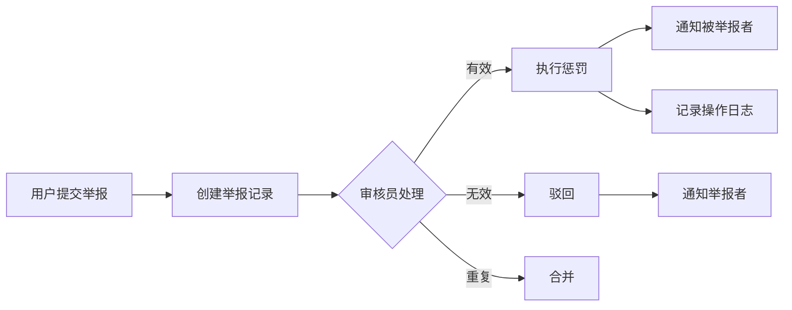
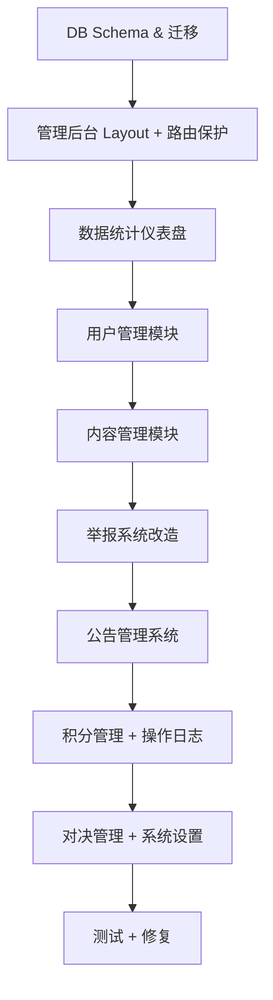

# Scholarly 后端管理系统规划

## 📊 项目现状分析

### 当前技术栈
| 层面 | 技术 |
|------|------|
| 框架 | Next.js 15 (App Router) |
| UI | Tailwind CSS v4 + Shadcn/UI |
| 后端 | Supabase (PostgreSQL + Auth + Realtime + Storage) |
| 语言 | TypeScript |
| 部署 | Vercel (推测) |

### 现有数据表 (26张)
| 模块 | 数据表 | 行数 |
|------|--------|------|
| 用户系统 | `profiles`, `user_credits`, `credit_transactions` | 10, 10, 61 |
| 内容系统 | `posts`, `comments`, `post_revisions`, `post_co_authors` | 22, 54, 16, 0 |
| 社交互动 | `likes`, `bookmarks`, `shares`, `friendships`, `messages`, `message_attachments` | 45, 12, 25, 5, 113, 13 |
| 学术对决 | `duels`, `duel_rounds`, `duel_invitations` | 2, 6, 2 |
| 协作实验室 | `lab_rooms`, `lab_members`, `lab_notes`, `lab_note_snapshots`, `lab_sessions`, `lab_session_participants`, `lab_post_links`, `lab_snapshots` | 全部 0 |
| 系统 | `notifications`, `_keep_alive` | 95, 1 |

### 现有管理能力
- ✅ `profiles.is_developer` 字段标识管理员（当前仅1位：邵卓翰）
- ✅ 举报系统已有前端 `ReportDialog` 组件（通过邮件通知，无数据库持久化）
- ❌ **无管理后台界面**
- ❌ **无举报记录表**
- ❌ **无管理员操作日志**
- ❌ **无内容审核工作流**

---

## 🏗️ 架构方案对比

### 方案 A：同项目集成（推荐 ✅）

在现有 Next.js 项目中添加 `/admin` 路由组。

```
src/app/(admin)/
├── layout.tsx              # 管理后台 Layout（侧边栏 + 顶栏）
├── admin/
│   ├── page.tsx            # 仪表盘首页
│   ├── users/              # 用户管理
│   ├── posts/              # 内容管理
│   ├── reports/            # 举报处理
│   ├── credits/            # 积分管理
│   ├── duels/              # 对决管理
│   ├── labs/               # 实验室管理
│   ├── announcements/      # 公告管理
│   └── settings/           # 系统设置
```

**优点：**
- 共享现有组件、类型定义和 Supabase 客户端
- 无需额外部署 and 维护成本
- 统一认证体系，减少复杂度
- 快速上线

**缺点：**
- 需要严格的路由保护
- 打包体积稍增

### 方案 B：独立管理后台

使用 Vite + React 构建独立 SPA，通过 Supabase SDK 直接连接同一数据库。

**优点：**
- 完全解耦，独立部署
- 管理后台崩溃不影响主站

**缺点：**
- 重复开发登录、组件等基础设施
- 维护两套代码库，类型定义需同步
- 开发周期延长约 2 倍

> [!IMPORTANT]
> **推荐方案 A**：考虑到项目处于初期阶段（10 用户），同项目集成能最大化复用已有代码，快速迭代。未来用户量增长后可随时拆分。

---

## 📐 功能模块设计

### Phase 1: 基础框架 + 数据看板 (1周)

#### 1.1 管理员权限体系
```
权限等级:
├── super_admin    ── 超级管理员（系统所有者，不可被降级）
├── admin          ── 管理员（完全管理权限）
├── moderator      ── 内容审核员（帖子/评论/举报管理）
└── analyst        ── 数据分析员（只读数据面板）
```

#### 1.2 数据统计仪表盘
```
┌─────────────────────────────────────────────────────┐
│  📊 Scholarly 管理后台                               │
├───────┬─────────────────────────────────────────────┤
│       │  总用户    新增(今日)  活跃(7天)  帖子总量   │
│ 导航  │   10        0          ?          22       │
│       │─────────────────────────────────────────────│
│ 仪表盘│                                             │
│ 用户  │  [用户增长折线图]       [帖子发布热力图]      │
│ 内容  │                                             │
│ 举报  │  [积分消费趋势]         [对决活跃度]          │
│ 积分  │─────────────────────────────────────────────│
│ 对决  │  最新举报    最新注册   最新帖子               │
│ 公告  │  • ...       • ...     • ...                │
│ 设置  │                                             │
└───────┴─────────────────────────────────────────────┘
```

**数据仪表盘指标：**
- 用户总量 / 今日新增 / 7日活跃 / 30日活跃
- 帖子总量 / 今日发布 / 评论总量 / 今日评论
- 对决总数 / 进行中 / 已完成
- 积分流通：总充值 / 总消费 / 平均余额
- 实验室：活跃房间数 / 总会议数
- 最近7天的注册/发帖趋势图表

### Phase 2: 用户管理 + 内容审核 (1.5周)

#### 2.1 用户管理

| 功能 | 描述 |
|------|------|
| 用户列表 | 分页浏览，支持搜索（用户名/邮箱）、筛选（VIP等级/角色） |
| 用户详情 | 查看完整 profile、发帖历史、评论历史、积分记录 |
| 角色管理 | 指派/撤销管理员角色 |
| VIP 管理 | 手动调整 VIP 等级、授予/取消称号 |
| 账号操作 | 禁言（指定时长）、封禁、解封 |
| 积分调整 | 手动增减积分（需记录原因） |

#### 2.2 内容管理

| 功能 | 描述 |
|------|------|
| 帖子列表 | 全部帖子浏览、搜索、按标签筛选 |
| 帖子操作 | 置顶、锁定评论、隐藏（软删除）、恢复 |
| 评论列表 | 按帖子或用户维度查看评论 |
| 评论操作 | 隐藏、删除 |
| 修订历史 | 查看帖子编辑记录（已有 `post_revisions`） |

### Phase 3: 举报处理 + 通知系统 (1.5周)

#### 3.1 举报工作流



**举报面板功能：**
- 待处理队列（按时间/严重度排序）
- 举报详情（含原始内容快照）
- 一键操作：删除内容 / 警告用户 / 禁言 / 封禁
- 批量处理
- 处理统计（处理率、平均响应时间）

#### 3.2 系统公告管理

| 功能 | 描述 |
|------|------|
| 公告 CRUD | 创建、编辑、删除系统公告 |
| 定时发布 | 设置公告的开始/结束时间 |
| 公告类别 | 系统通知、活动通知、维护通知、版本更新 |
| 受众选择 | 全部用户、VIP 用户、特定角色 |

### Phase 4: 高级功能 (2周)

#### 4.1 积分与经济系统管理
- 积分发放策略配置（注册奖励、每月奖励金额）
- 积分流水审计
- 批量积分发放（活动奖励）
- VIP 等级阈值配置

#### 4.2 学术对决管理
- 对决列表与详情
- 异常对决干预（强制结束、裁定结果）
- AI 裁判参数调整

#### 4.3 操作日志与审计
- 所有管理操作的完整审计日志
- 日志筛选和导出

#### 4.4 系统配置
- 注册设置（开放注册/邀请制）
- AI 功能开关与配额
- 全局通知配置

---

## 🗄️ 数据库 Schema 设计

### 新增表

#### `admin_roles` - 管理员角色表
```sql
CREATE TABLE public.admin_roles (
    id UUID PRIMARY KEY DEFAULT gen_random_uuid(),
    user_id UUID NOT NULL REFERENCES auth.users(id) ON DELETE CASCADE,
    role TEXT NOT NULL CHECK (role IN ('super_admin', 'admin', 'moderator', 'analyst')),
    granted_by UUID REFERENCES auth.users(id),
    granted_at TIMESTAMPTZ DEFAULT now(),
    UNIQUE(user_id)
);

-- 将现有 is_developer 用户迁移为 super_admin
```

#### `reports` - 举报记录表
```sql
CREATE TABLE public.reports (
    id UUID PRIMARY KEY DEFAULT gen_random_uuid(),
    reporter_id UUID NOT NULL REFERENCES auth.users(id),
    target_type TEXT NOT NULL CHECK (target_type IN ('post', 'comment', 'user', 'message')),
    target_id UUID NOT NULL,
    reason TEXT NOT NULL CHECK (reason IN ('spam', 'inappropriate', 'harassment', 'misinformation', 'copyright', 'other')),
    details TEXT,
    
    -- 处理信息
    status TEXT NOT NULL DEFAULT 'pending' CHECK (status IN ('pending', 'reviewing', 'resolved', 'rejected', 'merged')),
    handled_by UUID REFERENCES auth.users(id),
    handled_at TIMESTAMPTZ,
    action_taken TEXT CHECK (action_taken IN ('none', 'warning', 'content_hidden', 'content_deleted', 'user_muted', 'user_banned')),
    handler_note TEXT,
    
    -- 内容快照（防止被删除后无法审核）
    content_snapshot JSONB,
    
    created_at TIMESTAMPTZ DEFAULT now(),
    updated_at TIMESTAMPTZ DEFAULT now()
);

CREATE INDEX idx_reports_status ON public.reports(status);
CREATE INDEX idx_reports_target ON public.reports(target_type, target_id);
CREATE INDEX idx_reports_reporter ON public.reports(reporter_id);
```

#### `admin_action_logs` - 管理操作日志表
```sql
CREATE TABLE public.admin_action_logs (
    id UUID PRIMARY KEY DEFAULT gen_random_uuid(),
    admin_id UUID NOT NULL REFERENCES auth.users(id),
    action_type TEXT NOT NULL,
    -- 例: 'user_banned', 'post_hidden', 'report_resolved', 'credits_adjusted', 'role_changed'
    target_type TEXT NOT NULL,
    -- 例: 'user', 'post', 'comment', 'report', 'credits'
    target_id UUID,
    details JSONB DEFAULT '{}',
    -- 存储操作的详细信息，如 { "reason": "...", "old_value": ..., "new_value": ... }
    ip_address INET,
    created_at TIMESTAMPTZ DEFAULT now()
);

CREATE INDEX idx_admin_logs_admin ON public.admin_action_logs(admin_id);
CREATE INDEX idx_admin_logs_action ON public.admin_action_logs(action_type);
CREATE INDEX idx_admin_logs_created ON public.admin_action_logs(created_at DESC);
```

#### `system_settings` - 系统配置表
```sql
CREATE TABLE public.system_settings (
    key TEXT PRIMARY KEY,
    value JSONB NOT NULL,
    description TEXT,
    updated_by UUID REFERENCES auth.users(id),
    updated_at TIMESTAMPTZ DEFAULT now()
);

-- 预设默认配置
INSERT INTO public.system_settings (key, value, description) VALUES
    ('registration', '{"mode": "open", "require_email_verify": true}', '注册设置'),
    ('credits', '{"signup_bonus": 100, "monthly_bonus": 50, "ai_cost_per_query": 5}', '积分配置'),
    ('content', '{"max_post_title_length": 200, "max_tags": 5}', '内容限制'),
    ('ai', '{"enabled": true, "daily_limit_per_user": 20}', 'AI 功能设置');
```

#### 对 `profiles` 表的扩展
```sql
ALTER TABLE public.profiles 
    ADD COLUMN IF NOT EXISTS is_banned BOOLEAN DEFAULT false,
    ADD COLUMN IF NOT EXISTS banned_at TIMESTAMPTZ,
    ADD COLUMN IF NOT EXISTS banned_reason TEXT,
    ADD COLUMN IF NOT EXISTS is_muted BOOLEAN DEFAULT false,
    ADD COLUMN IF NOT EXISTS muted_until TIMESTAMPTZ,
    ADD COLUMN IF NOT EXISTS muted_reason TEXT;
```

### RLS 策略

```sql
-- admin_roles: 只有 super_admin 可以修改角色
ALTER TABLE public.admin_roles ENABLE ROW LEVEL SECURITY;

CREATE POLICY "Admin roles are viewable by admins" ON public.admin_roles
    FOR SELECT USING (
        EXISTS (
            SELECT 1 FROM public.admin_roles ar 
            WHERE ar.user_id = auth.uid()
        )
    );

CREATE POLICY "Only super_admin can manage roles" ON public.admin_roles
    FOR ALL USING (
        EXISTS (
            SELECT 1 FROM public.admin_roles ar 
            WHERE ar.user_id = auth.uid() AND ar.role = 'super_admin'
        )
    );

-- reports: 用户可创建举报，管理员可查看和处理
ALTER TABLE public.reports ENABLE ROW LEVEL SECURITY;

CREATE POLICY "Users can create reports" ON public.reports
    FOR INSERT WITH CHECK (auth.uid() = reporter_id);

CREATE POLICY "Users can view own reports" ON public.reports
    FOR SELECT USING (
        auth.uid() = reporter_id 
        OR EXISTS (
            SELECT 1 FROM public.admin_roles ar 
            WHERE ar.user_id = auth.uid() 
            AND ar.role IN ('super_admin', 'admin', 'moderator')
        )
    );

CREATE POLICY "Admins can update reports" ON public.reports
    FOR UPDATE USING (
        EXISTS (
            SELECT 1 FROM public.admin_roles ar 
            WHERE ar.user_id = auth.uid() 
            AND ar.role IN ('super_admin', 'admin', 'moderator')
        )
    );

-- admin_action_logs: 只有管理员可查看
ALTER TABLE public.admin_action_logs ENABLE ROW LEVEL SECURITY;

CREATE POLICY "Admins can view action logs" ON public.admin_action_logs
    FOR SELECT USING (
        EXISTS (
            SELECT 1 FROM public.admin_roles ar 
            WHERE ar.user_id = auth.uid()
        )
    );

CREATE POLICY "Admins can insert action logs" ON public.admin_action_logs
    FOR INSERT WITH CHECK (
        EXISTS (
            SELECT 1 FROM public.admin_roles ar 
            WHERE ar.user_id = auth.uid()
        )
    );

-- system_settings: 管理员可读，super_admin 可写
ALTER TABLE public.system_settings ENABLE ROW LEVEL SECURITY;

CREATE POLICY "Admins can view settings" ON public.system_settings
    FOR SELECT USING (
        EXISTS (
            SELECT 1 FROM public.admin_roles ar 
            WHERE ar.user_id = auth.uid()
        )
    );

CREATE POLICY "Super admin can modify settings" ON public.system_settings
    FOR ALL USING (
        EXISTS (
            SELECT 1 FROM public.admin_roles ar 
            WHERE ar.user_id = auth.uid() AND ar.role = 'super_admin'
        )
    );
```

---

## 📁 前端 文件结构

```
src/
├── app/
│   ├── (admin)/                         # 管理后台路由组
│   │   ├── layout.tsx                   # 管理后台 Layout
│   │   ├── admin/
│   │   │   ├── page.tsx                 # 仪表盘
│   │   │   ├── users/
│   │   │   │   ├── page.tsx             # 用户列表
│   │   │   │   └── [id]/page.tsx        # 用户详情
│   │   │   ├── posts/
│   │   │   │   ├── page.tsx             # 帖子列表
│   │   │   │   └── [id]/page.tsx        # 帖子详情
│   │   │   ├── reports/
│   │   │   │   ├── page.tsx             # 举报列表
│   │   │   │   └── [id]/page.tsx        # 举报详情
│   │   │   ├── credits/
│   │   │   │   └── page.tsx             # 积分管理
│   │   │   ├── duels/
│   │   │   │   └── page.tsx             # 对决管理
│   │   │   ├── announcements/
│   │   │   │   └── page.tsx             # 公告管理
│   │   │   ├── logs/
│   │   │   │   └── page.tsx             # 操作日志
│   │   │   └── settings/
│   │   │       └── page.tsx             # 系统设置
│   │   └── ...
├── components/
│   ├── admin/                           # 管理后台专用组件
│   │   ├── AdminSidebar.tsx             # 侧边导航
│   │   ├── AdminHeader.tsx              # 顶部栏
│   │   ├── StatsCard.tsx                # 统计卡片
│   │   ├── DataTable.tsx                # 通用数据表格
│   │   ├── UserActionMenu.tsx           # 用户操作菜单
│   │   ├── ReportHandler.tsx            # 举报处理组件
│   │   └── charts/                      # 图表组件
│   │       ├── LineChart.tsx
│   │       ├── BarChart.tsx
│   │       └── PieChart.tsx
├── lib/
│   ├── admin/
│   │   ├── queries.ts                   # 管理后台数据查询
│   │   ├── actions.ts                   # Server Actions
│   │   └── permissions.ts               # 权限检查工具
```

---

## 🔐 安全考量

### Middleware 层防护
```typescript
// 在 middleware.ts 中增加管理路由保护
if (request.nextUrl.pathname.startsWith('/admin')) {
    // 1. 验证用户已登录
    // 2. 查询 admin_roles 表确认权限
    // 3. 无权限则重定向到 403 页面
}
```

### Server Action 层校验
```typescript
// 每个管理 Server Action 都必须
async function adminAction() {
    const { user } = await getUser();
    const adminRole = await checkAdminRole(user.id);
    if (!adminRole) throw new Error('权限不足');
    // ... 执行操作
    // 记录操作日志
    await logAdminAction({ ... });
}
```

### 关键安全规则
1. **所有管理 API 双重验证**：中间件 + Server Action 内部都要检查权限
2. **敏感操作需要二次确认**：封禁用户、删除内容等需要确认弹窗
3. **操作日志不可删除**：`admin_action_logs` 表不设 DELETE 策略
4. **Rate Limiting**：批量操作需限流
5. **RLS 策略生效**：即使前端被绕过，数据库层也有保护

---

## 📊 推荐新增依赖

```bash
# 图表库（轻量级，适合仪表盘）
npm install recharts

# 日期处理（用于统计时间范围选择）
npm install date-fns

# 数据表格增强（可选，已有 Shadcn 的 Table）
npm install @tanstack/react-table
```

---

## 🗓️ 实施路线图



---

## ❓ 需要你确认的问题

1. **架构选择**：你倾向于方案 A（同项目集成）还是方案 B（独立应用）？
2. **优先级排序**：你希望先做哪个模块？我建议从 Phase 1 开始，但如果你有紧迫的需求（如举报处理）可以调整。
3. **图表库**：数据仪表盘你倾向于用 `recharts`（React 原生）还是 `Chart.js`？
4. **管理员数量**：近期是否需要多管理员支持，还是暂时只有你一人管理？
5. **是否需要暗色模式**：管理后台是否沿用主站的主题系统？
6. **是否要移动端适配**：管理后台是否需要手机上操作？
