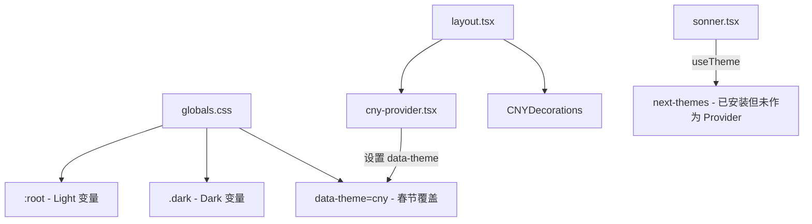
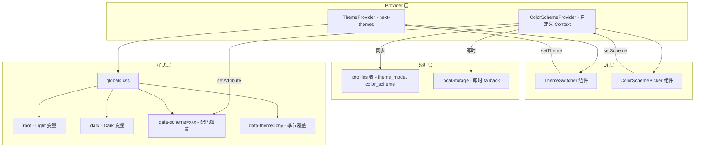

# 🌙 方向 D · 全站主题系统升级 — 技术实现方案

> **文档版本**: v1.0  
> **创建日期**: 2026-02-28  
> **状态**: 📋 规划中  
> **预估工时**: 4–6 天（分 5 个 Phase）

---

## 📌 目标概览

将 Scholarly 从当前的 **Light-only + CNY 季节性主题** 扩展为完整的 **三档主题切换 + 全站配色方案系统**，并为所有 UI 组件注入流畅的主题切换过渡动画。

### 核心需求

| # | 需求 | 描述 |
|---|------|------|
| D1 | 三档主题切换 | Light / Dark / System Auto，用户可手动切换 |
| D2 | 全站配色方案 | 预设 5–8 套配色（不仅是个人主页背景），全站同步变化 |
| D3 | 组件主题适配 | 导航栏、卡片、按钮、侧边栏等随主题 + 配色变化 |
| D4 | 切换过渡动画 | 主题切换时全站颜色流畅渐变，避免闪白/闪黑 |
| D5 | 用户偏好持久化 | 主题和配色选择保存到 Supabase `profiles` 表 |

---

## 🧩 现有架构分析

### 当前状态



### 关键发现

1. **`next-themes` 已安装** (`^0.4.6`)，但**未配置 `ThemeProvider`**，仅在 `sonner.tsx` 中作为 `useTheme()` 使用（默认 fallback 到 `"system"`）
2. **CSS 变量已定义**：`:root` (light) 和 `.dark` (dark) 使用 oklch 色彩空间，shadcn/ui 标准结构
3. **`@custom-variant dark (&:is(.dark *))` 已配置**：Tailwind v4 的 dark mode variant 已就绪
4. **CNY 主题通过 `data-theme="cny"`** 实现季节性覆盖，使用 `documentElement.setAttribute`
5. **`suppressHydrationWarning`**：`<html>` 标签已加上，利于 next-themes 注入
6. **`framer-motion` 已安装**：可直接用于切换动画
7. **全局布局** (`layout.tsx`) 目前仅包裹 `CNYProvider`，无 `ThemeProvider`

### 现有 CSS 变量体系（标准 shadcn/ui）

```
--background, --foreground
--card, --card-foreground
--popover, --popover-foreground
--primary, --primary-foreground
--secondary, --secondary-foreground
--muted, --muted-foreground
--accent, --accent-foreground
--destructive
--border, --input, --ring
--sidebar-*, --chart-*
```

---

## 🏗️ 技术方案设计

### 整体架构



### 核心技术选择

| 功能 | 技术方案 | 理由 |
|------|----------|------|
| Light/Dark 切换 | `next-themes` ThemeProvider | 已安装，SSR 友好，无闪烁 |
| 配色方案切换 | 自定义 Context + CSS `data-scheme` 属性 | 与 next-themes 解耦，灵活可扩展 |
| 过渡动画 | CSS `transition` on `*` + `view-transition-api` fallback | 性能最优，无需 JS 逐元素操作 |
| 持久化 | Supabase `profiles` 表 + localStorage 双写 | 跨设备同步 + 即时生效 |

---

## 📂 文件变更清单

### 新增文件

```
src/
├── components/theme/
│   ├── theme-provider.tsx          # next-themes ThemeProvider 封装
│   ├── theme-switcher.tsx          # Light/Dark/System 三档切换 UI
│   ├── color-scheme-provider.tsx   # 配色方案 Context Provider
│   ├── color-scheme-picker.tsx     # 配色选择器 UI（下拉/面板）
│   └── theme-transition.tsx        # 切换过渡动画效果 (View Transition API hook)
├── hooks/
│   └── use-color-scheme.ts         # 配色方案 hook (re-export)
└── lib/
    └── theme-config.ts             # 配色方案定义 & 常量
```

### 修改文件

```
src/app/layout.tsx                  # 注入 ThemeProvider + ColorSchemeProvider
src/app/globals.css                 # 新增配色方案 CSS 变量 + 过渡样式
src/components/theme/cny-provider.tsx  # 兼容适配 next-themes
src/components/dashboard/MainNav.tsx   # 新增主题/配色切换入口
src/app/(protected)/dashboard/page.tsx # 顶栏嵌入 ThemeSwitcher
src/app/(protected)/settings/profile/page.tsx  # 新增外观设置分组
```

### 数据库变更

```
supabase/migrations/xxx_add_theme_preferences.sql
  - profiles 表增加 theme_mode, color_scheme 字段
```

---

## 🎨 Phase 1：主题基础设施搭建

> **目标**：接入 `next-themes` Provider，实现 Light / Dark / System 三档切换  
> **预估**：0.5 天

### Step 1.1 — 创建 ThemeProvider 封装

**文件**: `src/components/theme/theme-provider.tsx` (新建)

```tsx
"use client";

import { ThemeProvider as NextThemesProvider } from "next-themes";

interface ThemeProviderProps {
  children: React.ReactNode;
  defaultTheme?: string;
  storageKey?: string;
}

export function ThemeProvider({
  children,
  defaultTheme = "system",
  storageKey = "scholarly-theme",
}: ThemeProviderProps) {
  return (
    <NextThemesProvider
      attribute="class"          // 使用 .dark class（匹配 Tailwind v4 custom-variant）
      defaultTheme={defaultTheme}
      enableSystem                // 启用跟随系统
      disableTransitionOnChange={false}  // 允许 CSS transition
      storageKey={storageKey}
    >
      {children}
    </NextThemesProvider>
  );
}
```

> [!IMPORTANT]
> `attribute="class"` 是关键——对应 globals.css 中已有的 `.dark { ... }` 和 `@custom-variant dark (&:is(.dark *))`。这意味着 next-themes 会在 `<html>` 上切换 `class="dark"`，Tailwind v4 的 dark variant 自动生效。

### Step 1.2 — 修改根 Layout

**文件**: `src/app/layout.tsx`

```diff
+import { ThemeProvider } from "@/components/theme/theme-provider";
 import { CNYProvider } from "@/components/theme/cny-provider";
 // ...其余 import 不变

 export default function RootLayout({ children }: { children: React.ReactNode }) {
   return (
     <html lang="zh" suppressHydrationWarning>
       <body className={`${geistSans.variable} ${geistMono.variable} antialiased`} suppressHydrationWarning>
-        <CNYProvider>
-          <CNYDecorations />
-          {children}
-          <Toaster />
-        </CNYProvider>
+        <ThemeProvider>
+          <CNYProvider>
+            <CNYDecorations />
+            {children}
+            <Toaster />
+          </CNYProvider>
+        </ThemeProvider>
       </body>
     </html>
   );
 }
```

### Step 1.3 — 创建主题切换组件

**文件**: `src/components/theme/theme-switcher.tsx` (新建)

```tsx
"use client";

import { useTheme } from "next-themes";
import { useEffect, useState } from "react";
import { Sun, Moon, Monitor } from "lucide-react";
import { motion, AnimatePresence } from "framer-motion";
import { Button } from "@/components/ui/button";
import {
  DropdownMenu,
  DropdownMenuContent,
  DropdownMenuItem,
  DropdownMenuTrigger,
} from "@/components/ui/dropdown-menu";

const themes = [
  { value: "light",  label: "浅色模式", icon: Sun },
  { value: "dark",   label: "深色模式", icon: Moon },
  { value: "system", label: "跟随系统", icon: Monitor },
] as const;

export function ThemeSwitcher() {
  const { theme, setTheme, resolvedTheme } = useTheme();
  const [mounted, setMounted] = useState(false);

  useEffect(() => setMounted(true), []);

  // 避免 SSR hydration 不匹配
  if (!mounted) {
    return (
      <Button variant="ghost" size="icon" className="h-9 w-9 rounded-full">
        <div className="h-4 w-4 animate-pulse rounded-full bg-muted" />
      </Button>
    );
  }

  const CurrentIcon = resolvedTheme === "dark" ? Moon : Sun;

  return (
    <DropdownMenu>
      <DropdownMenuTrigger asChild>
        <Button
          variant="ghost"
          size="icon"
          className="h-9 w-9 rounded-full relative overflow-hidden"
        >
          <AnimatePresence mode="wait" initial={false}>
            <motion.div
              key={resolvedTheme}
              initial={{ y: -20, opacity: 0, rotate: -90 }}
              animate={{ y: 0, opacity: 1, rotate: 0 }}
              exit={{ y: 20, opacity: 0, rotate: 90 }}
              transition={{ duration: 0.25, ease: [0.22, 1, 0.36, 1] }}
            >
              <CurrentIcon className="h-4 w-4" />
            </motion.div>
          </AnimatePresence>
          <span className="sr-only">切换主题</span>
        </Button>
      </DropdownMenuTrigger>
      <DropdownMenuContent align="end" className="w-40">
        {themes.map(({ value, label, icon: Icon }) => (
          <DropdownMenuItem
            key={value}
            onClick={() => setTheme(value)}
            className={`gap-2 cursor-pointer ${
              theme === value ? "bg-accent text-accent-foreground" : ""
            }`}
          >
            <Icon className="h-4 w-4" />
            {label}
            {theme === value && (
              <motion.div
                layoutId="theme-check"
                className="ml-auto h-1.5 w-1.5 rounded-full bg-primary"
              />
            )}
          </DropdownMenuItem>
        ))}
      </DropdownMenuContent>
    </DropdownMenu>
  );
}
```

### Step 1.4 — 嵌入 Dashboard 顶部导航

在 `src/app/(protected)/dashboard/page.tsx` 的顶部导航右侧操作区（通知中心旁）插入：

```diff
+import { ThemeSwitcher } from "@/components/theme/theme-switcher";

 {/* 右侧操作区 */}
 <div className="flex items-center gap-2">
+  {/* 主题切换 */}
+  <ThemeSwitcher />
+
   {/* 通知中心 */}
   {currentUserId && <NotificationCenter currentUserId={currentUserId} />}
   ...
 </div>
```

---

## 🎨 Phase 2：全站配色方案系统

> **目标**：定义多套配色，用户可选择全站应用  
> **预估**：1.5 天

### Step 2.1 — 配色方案定义

**文件**: `src/lib/theme-config.ts` (新建)

```ts
export interface ColorScheme {
  id: string;
  name: string;           // 中文名
  description: string;    // 描述
  preview: {
    primary: string;      // 预览用主色 (hex)
    secondary: string;    // 预览用副色 (hex)
    accent: string;       // 预览用强调色 (hex)
  };
}

export const colorSchemes: ColorScheme[] = [
  {
    id: "default",
    name: "经典黑白",
    description: "简洁素雅的学术风格",
    preview: { primary: "#171717", secondary: "#f5f5f5", accent: "#737373" },
  },
  {
    id: "ocean",
    name: "深海蓝",
    description: "沉稳冷静的海洋蓝调",
    preview: { primary: "#2563eb", secondary: "#dbeafe", accent: "#3b82f6" },
  },
  {
    id: "emerald",
    name: "翡翠绿",
    description: "清新自然的绿色生机",
    preview: { primary: "#059669", secondary: "#d1fae5", accent: "#10b981" },
  },
  {
    id: "violet",
    name: "学院紫",
    description: "高贵优雅的紫色格调",
    preview: { primary: "#7c3aed", secondary: "#ede9fe", accent: "#8b5cf6" },
  },
  {
    id: "rose",
    name: "玫瑰粉",
    description: "温柔浪漫的粉色色调",
    preview: { primary: "#e11d48", secondary: "#ffe4e6", accent: "#f43f5e" },
  },
  {
    id: "amber",
    name: "琥珀金",
    description: "温暖明亮的金色调",
    preview: { primary: "#d97706", secondary: "#fef3c7", accent: "#f59e0b" },
  },
  {
    id: "slate",
    name: "青石灰",
    description: "低调成熟的灰色调",
    preview: { primary: "#475569", secondary: "#f1f5f9", accent: "#64748b" },
  },
  {
    id: "teal",
    name: "青碧色",
    description: "知性典雅的青绿色调",
    preview: { primary: "#0d9488", secondary: "#ccfbf1", accent: "#14b8a6" },
  },
];

export const DEFAULT_COLOR_SCHEME = "default";
export const DEFAULT_THEME_MODE = "system";
```

### Step 2.2 — 配色 CSS 变量

**文件**: `src/app/globals.css` 新增部分

每套配色同时提供 Light 和 Dark 两个版本。仅覆盖**与色彩相关的变量**（primary、ring、sidebar-primary、chart-1），背景/前景/muted 等保持不变，以确保可读性。

```css
/* ============================================
   全站配色方案 (Color Schemes)
   优先级: data-theme(CNY) > data-scheme > :root/.dark
   ============================================ */

/* --- Ocean 深海蓝 --- */
:root[data-scheme="ocean"] {
  --primary: oklch(0.55 0.2 260);
  --primary-foreground: oklch(0.985 0 0);
  --ring: oklch(0.6 0.18 260);
  --sidebar-primary: oklch(0.55 0.2 260);
  --chart-1: oklch(0.55 0.2 260);
}
.dark[data-scheme="ocean"] {
  --primary: oklch(0.7 0.18 260);
  --primary-foreground: oklch(0.15 0 0);
  --ring: oklch(0.65 0.16 260);
  --sidebar-primary: oklch(0.7 0.18 260);
  --chart-1: oklch(0.7 0.18 260);
}

/* --- Emerald 翡翠绿 --- */
:root[data-scheme="emerald"] {
  --primary: oklch(0.55 0.17 160);
  --primary-foreground: oklch(0.985 0 0);
  --ring: oklch(0.6 0.15 160);
  --sidebar-primary: oklch(0.55 0.17 160);
  --chart-1: oklch(0.55 0.17 160);
}
.dark[data-scheme="emerald"] {
  --primary: oklch(0.7 0.16 160);
  --primary-foreground: oklch(0.15 0 0);
  --ring: oklch(0.65 0.14 160);
  --sidebar-primary: oklch(0.7 0.16 160);
  --chart-1: oklch(0.7 0.16 160);
}

/* --- Violet 学院紫 --- */
:root[data-scheme="violet"] {
  --primary: oklch(0.5 0.22 280);
  --primary-foreground: oklch(0.985 0 0);
  --ring: oklch(0.55 0.2 280);
  --sidebar-primary: oklch(0.5 0.22 280);
  --chart-1: oklch(0.5 0.22 280);
}
.dark[data-scheme="violet"] {
  --primary: oklch(0.68 0.2 280);
  --primary-foreground: oklch(0.15 0 0);
  --ring: oklch(0.63 0.18 280);
  --sidebar-primary: oklch(0.68 0.2 280);
  --chart-1: oklch(0.68 0.2 280);
}

/* --- Rose 玫瑰粉 --- */
:root[data-scheme="rose"] {
  --primary: oklch(0.55 0.22 10);
  --primary-foreground: oklch(0.985 0 0);
  --ring: oklch(0.6 0.2 10);
  --sidebar-primary: oklch(0.55 0.22 10);
  --chart-1: oklch(0.55 0.22 10);
}
.dark[data-scheme="rose"] {
  --primary: oklch(0.7 0.2 10);
  --primary-foreground: oklch(0.15 0 0);
  --ring: oklch(0.65 0.18 10);
  --sidebar-primary: oklch(0.7 0.2 10);
  --chart-1: oklch(0.7 0.2 10);
}

/* --- Amber 琥珀金 --- */
:root[data-scheme="amber"] {
  --primary: oklch(0.65 0.18 75);
  --primary-foreground: oklch(0.15 0 0);
  --ring: oklch(0.7 0.16 75);
  --sidebar-primary: oklch(0.65 0.18 75);
  --chart-1: oklch(0.65 0.18 75);
}
.dark[data-scheme="amber"] {
  --primary: oklch(0.75 0.16 75);
  --primary-foreground: oklch(0.15 0 0);
  --ring: oklch(0.7 0.14 75);
  --sidebar-primary: oklch(0.75 0.16 75);
  --chart-1: oklch(0.75 0.16 75);
}

/* --- Slate 青石灰 --- */
:root[data-scheme="slate"] {
  --primary: oklch(0.45 0.03 260);
  --primary-foreground: oklch(0.985 0 0);
  --ring: oklch(0.5 0.03 260);
  --sidebar-primary: oklch(0.45 0.03 260);
  --chart-1: oklch(0.45 0.03 260);
}
.dark[data-scheme="slate"] {
  --primary: oklch(0.65 0.03 260);
  --primary-foreground: oklch(0.15 0 0);
  --ring: oklch(0.6 0.03 260);
  --sidebar-primary: oklch(0.65 0.03 260);
  --chart-1: oklch(0.65 0.03 260);
}

/* --- Teal 青碧色 --- */
:root[data-scheme="teal"] {
  --primary: oklch(0.55 0.15 180);
  --primary-foreground: oklch(0.985 0 0);
  --ring: oklch(0.6 0.13 180);
  --sidebar-primary: oklch(0.55 0.15 180);
  --chart-1: oklch(0.55 0.15 180);
}
.dark[data-scheme="teal"] {
  --primary: oklch(0.7 0.14 180);
  --primary-foreground: oklch(0.15 0 0);
  --ring: oklch(0.65 0.12 180);
  --sidebar-primary: oklch(0.7 0.14 180);
  --chart-1: oklch(0.7 0.14 180);
}
```

### Step 2.3 — 配色方案 Context Provider

**文件**: `src/components/theme/color-scheme-provider.tsx` (新建)

```tsx
"use client";

import { createContext, useCallback, useContext, useEffect, useState } from "react";
import { DEFAULT_COLOR_SCHEME, colorSchemes, type ColorScheme } from "@/lib/theme-config";
import { createClient } from "@/lib/supabase/client";

interface ColorSchemeContextType {
  scheme: string;
  setScheme: (scheme: string) => void;
  schemes: ColorScheme[];
  isLoading: boolean;
}

const ColorSchemeContext = createContext<ColorSchemeContextType>({
  scheme: DEFAULT_COLOR_SCHEME,
  setScheme: () => {},
  schemes: colorSchemes,
  isLoading: true,
});

export function useColorScheme() {
  return useContext(ColorSchemeContext);
}

const STORAGE_KEY = "scholarly-color-scheme";

export function ColorSchemeProvider({ children }: { children: React.ReactNode }) {
  const [scheme, setSchemeState] = useState(DEFAULT_COLOR_SCHEME);
  const [isLoading, setIsLoading] = useState(true);
  const supabase = createClient();

  // 应用配色到 DOM
  const applyScheme = useCallback((schemeId: string) => {
    if (schemeId === "default") {
      document.documentElement.removeAttribute("data-scheme");
    } else {
      document.documentElement.setAttribute("data-scheme", schemeId);
    }
  }, []);

  // 初始化：先读 localStorage (instant)，再读 Supabase (async sync)
  useEffect(() => {
    const saved = localStorage.getItem(STORAGE_KEY);
    if (saved && colorSchemes.some((s) => s.id === saved)) {
      setSchemeState(saved);
      applyScheme(saved);
    }

    // 从 Supabase 同步
    (async () => {
      const { data: { user } } = await supabase.auth.getUser();
      if (user) {
        const { data } = await supabase
          .from("profiles")
          .select("color_scheme")
          .eq("id", user.id)
          .single();

        if (data?.color_scheme && colorSchemes.some((s) => s.id === data.color_scheme)) {
          setSchemeState(data.color_scheme);
          applyScheme(data.color_scheme);
          localStorage.setItem(STORAGE_KEY, data.color_scheme);
        }
      }
      setIsLoading(false);
    })();
  }, [supabase, applyScheme]);

  // 设置配色（双写 localStorage + Supabase）
  const setScheme = useCallback(
    async (newScheme: string) => {
      setSchemeState(newScheme);
      applyScheme(newScheme);
      localStorage.setItem(STORAGE_KEY, newScheme);

      // 异步同步到 Supabase
      const { data: { user } } = await supabase.auth.getUser();
      if (user) {
        await supabase
          .from("profiles")
          .update({ color_scheme: newScheme })
          .eq("id", user.id);
      }
    },
    [supabase, applyScheme]
  );

  return (
    <ColorSchemeContext.Provider
      value={{ scheme, setScheme, schemes: colorSchemes, isLoading }}
    >
      {children}
    </ColorSchemeContext.Provider>
  );
}
```

### Step 2.4 — 配色选择器组件

**文件**: `src/components/theme/color-scheme-picker.tsx` (新建)

```tsx
"use client";

import { useColorScheme } from "./color-scheme-provider";
import { motion } from "framer-motion";
import { Check, Palette } from "lucide-react";
import {
  Popover, PopoverContent, PopoverTrigger
} from "@/components/ui/popover";
import { Button } from "@/components/ui/button";

export function ColorSchemePicker() {
  const { scheme, setScheme, schemes } = useColorScheme();

  return (
    <Popover>
      <PopoverTrigger asChild>
        <Button variant="ghost" size="icon" className="h-9 w-9 rounded-full">
          <Palette className="h-4 w-4" />
          <span className="sr-only">选择配色</span>
        </Button>
      </PopoverTrigger>
      <PopoverContent className="w-72 p-3" align="end">
        <div className="space-y-2">
          <p className="text-sm font-semibold text-foreground px-1">全站配色</p>
          <p className="text-xs text-muted-foreground px-1">
            选择偏好配色，全站同步应用
          </p>
          <div className="grid grid-cols-4 gap-2 pt-2">
            {schemes.map((s) => (
              <motion.button
                key={s.id}
                whileHover={{ scale: 1.1 }}
                whileTap={{ scale: 0.95 }}
                onClick={() => setScheme(s.id)}
                className={`relative flex flex-col items-center gap-1.5 p-2 rounded-lg border transition-colors ${
                  scheme === s.id
                    ? "border-primary bg-primary/5"
                    : "border-transparent hover:border-border hover:bg-muted/50"
                }`}
                title={s.description}
              >
                {/* 三色预览圆点 */}
                <div className="flex gap-0.5">
                  <div
                    className="h-4 w-4 rounded-full ring-1 ring-black/10"
                    style={{ backgroundColor: s.preview.primary }}
                  />
                  <div
                    className="h-4 w-4 rounded-full ring-1 ring-black/10"
                    style={{ backgroundColor: s.preview.accent }}
                  />
                  <div
                    className="h-4 w-4 rounded-full ring-1 ring-black/10"
                    style={{ backgroundColor: s.preview.secondary }}
                  />
                </div>
                <span className="text-[10px] text-muted-foreground leading-none">
                  {s.name}
                </span>
                {/* 选中指示 */}
                {scheme === s.id && (
                  <motion.div
                    layoutId="scheme-check"
                    className="absolute -top-1 -right-1 h-4 w-4 rounded-full bg-primary flex items-center justify-center"
                  >
                    <Check className="h-2.5 w-2.5 text-primary-foreground" />
                  </motion.div>
                )}
              </motion.button>
            ))}
          </div>
        </div>
      </PopoverContent>
    </Popover>
  );
}
```

---

## 🎬 Phase 3：主题切换过渡动画

> **目标**：切换主题时全站颜色流畅渐变，避免闪白/闪黑  
> **预估**：0.5 天

### Step 3.1 — 全局过渡 CSS

在 `src/app/globals.css` 的 `@layer base` 中添加：

```css
@layer base {
  /* 全局主题切换过渡 */
  *,
  *::before,
  *::after {
    transition-property: color, background-color, border-color, 
                         box-shadow, outline-color, fill, stroke;
    transition-duration: 300ms;
    transition-timing-function: cubic-bezier(0.22, 1, 0.36, 1);
  }

  /* 排除动画性能敏感元素 */
  .no-theme-transition,
  .no-theme-transition *,
  pre, pre *,
  code, code *,
  canvas,
  video,
  img {
    transition-property: none !important;
  }
}
```

> [!WARNING]
> 全局 `*` transition 可能导致某些动画（如 framer-motion 的位置动画）受到干扰。通过 `.no-theme-transition` 类可以手动排除。代码块和媒体元素默认排除以保证性能。实际调试时可能需要进一步优化排除列表。

### Step 3.2 — 高级切换效果（View Transition API 圆形扩散）

**文件**: `src/components/theme/theme-transition.tsx` (新建)

```tsx
"use client";

import { useTheme } from "next-themes";
import { useCallback } from "react";

/**
 * 使用 View Transition API (Chrome 111+) 实现圆形扩散动画
 * 降级方案：直接切换（有 CSS transition 兜底）
 */
export function useThemeTransition() {
  const { setTheme } = useTheme();

  const setThemeWithTransition = useCallback(
    (newTheme: string, event?: React.MouseEvent) => {
      // 不支持 View Transition API 或用户偏好减少动画
      if (
        !document.startViewTransition ||
        window.matchMedia("(prefers-reduced-motion: reduce)").matches
      ) {
        setTheme(newTheme);
        return;
      }

      // 获取点击坐标（从切换按钮位置开始扩散）
      const x = event?.clientX ?? window.innerWidth / 2;
      const y = event?.clientY ?? 0;

      // 计算扩散半径（确保覆盖整个屏幕）
      const endRadius = Math.hypot(
        Math.max(x, window.innerWidth - x),
        Math.max(y, window.innerHeight - y)
      );

      const transition = document.startViewTransition(() => {
        setTheme(newTheme);
      });

      transition.ready.then(() => {
        document.documentElement.animate(
          {
            clipPath: [
              `circle(0px at ${x}px ${y}px)`,
              `circle(${endRadius}px at ${x}px ${y}px)`,
            ],
          },
          {
            duration: 500,
            easing: "cubic-bezier(0.22, 1, 0.36, 1)",
            pseudoElement: "::view-transition-new(root)",
          }
        );
      });
    },
    [setTheme]
  );

  return { setThemeWithTransition };
}
```

配套 CSS（加在 `globals.css` 底部）：

```css
/* ============================================
   View Transition API - 主题切换圆形扩散
   ============================================ */
::view-transition-old(root),
::view-transition-new(root) {
  animation: none;
  mix-blend-mode: normal;
}

::view-transition-old(root) {
  z-index: 1;
}

::view-transition-new(root) {
  z-index: 9999;
}
```

> [!TIP]
> 使用此 hook 后，ThemeSwitcher 组件中的 `onClick` 回调可传入鼠标事件来触发从按钮位置开始的圆形扩散动画。在不支持的浏览器上会优雅降级为 CSS 渐变过渡。

---

## 💾 Phase 4：数据持久化

> **目标**：将用户主题偏好保存到 Supabase  
> **预估**：0.5 天

### Step 4.1 — 数据库迁移

```sql
-- Migration: add_theme_preferences
-- 为 profiles 表增加主题偏好字段

ALTER TABLE public.profiles
ADD COLUMN IF NOT EXISTS theme_mode text DEFAULT 'system',
ADD COLUMN IF NOT EXISTS color_scheme text DEFAULT 'default';

-- 添加约束
ALTER TABLE public.profiles
ADD CONSTRAINT profiles_theme_mode_check
CHECK (theme_mode IN ('light', 'dark', 'system'));

-- 不添加 color_scheme 的 enum 约束，以便未来轻松扩展新配色

COMMENT ON COLUMN public.profiles.theme_mode IS '主题模式: light, dark, system';
COMMENT ON COLUMN public.profiles.color_scheme IS '配色方案 ID, 对应前端 colorSchemes 定义';
```

### Step 4.2 — 初始化同步逻辑

在 Dashboard 加载时读取用户的 `theme_mode` 并应用。`color_scheme` 由 `ColorSchemeProvider` 自行处理：

```tsx
// 在 dashboard/page.tsx 的 useEffect 中增加：
import { useTheme } from "next-themes";

// ...inside component:
const { setTheme } = useTheme();

useEffect(() => {
  const syncThemePreference = async () => {
    const { data: { user } } = await supabase.auth.getUser();
    if (!user) return;

    const { data } = await supabase
      .from("profiles")
      .select("theme_mode")
      .eq("id", user.id)
      .single();

    if (data?.theme_mode) {
      setTheme(data.theme_mode);
    }
  };
  syncThemePreference();
}, [supabase, setTheme]);
```

### Step 4.3 — 保存主题模式变更

扩展 `ThemeSwitcher` 组件，在用户切换主题时异步保存到 Supabase：

```tsx
const handleThemeChange = async (newTheme: string) => {
  setTheme(newTheme);
  
  // 异步写入 Supabase（不阻塞 UI）
  const { data: { user } } = await supabase.auth.getUser();
  if (user) {
    await supabase
      .from("profiles")
      .update({ theme_mode: newTheme })
      .eq("id", user.id);
  }
};
```

---

## ⚙️ Phase 5：组件适配与兼容性处理

> **目标**：确保全站各组件完美适配主题系统  
> **预估**：1.5–2 天

### 5.1 — CNY Provider 兼容适配

修改 `src/components/theme/cny-provider.tsx`，使其与 `next-themes` 正确共存：

```diff
 "use client";
 
+import { useTheme } from "next-themes";
 import { useEffect, useState } from "react";
 
 export function CNYProvider({ children }: { children: React.ReactNode }) {
     const [isCNY, setIsCNY] = useState(false);
+    const { resolvedTheme } = useTheme();
 
     useEffect(() => {
-        const checkCNY = () => {
             const now = new Date();
             const currentYear = now.getFullYear();
             const startDate = new Date(currentYear, 1, 17);
-            const endDate = new Date(currentYear, 2, 31);
-            endDate.setHours(23, 59, 59);
+            const endDate = new Date(currentYear, 2, 31, 23, 59, 59);
 
             if (now >= startDate && now <= endDate) {
                 document.documentElement.setAttribute("data-theme", "cny");
                 setIsCNY(true);
             } else {
                 document.documentElement.removeAttribute("data-theme");
                 setIsCNY(false);
             }
-        };
-        checkCNY();
-    }, []);
+    }, [resolvedTheme]); // 主题变化时重新确保 data-theme 正确
 
     return <>{children}</>;
 }
```

> [!NOTE]
> **CSS 优先级策略**：在 globals.css 中，确保 CNY 部分的 CSS 块放在配色方案之后（CSS 后来者居上），这样春节期间 CNY 主题自动覆盖当前配色的 `--primary` 等变量。

### 5.2 — 需要检查和修改的现有组件

全站组件适配检查清单：

| 文件 | 问题 | 处理方式 |
|------|------|----------|
| `PostCard.tsx` | `dark:!text-amber-400` 等 Tw dark variant | ✅ 保留（自动工作） |
| `MainNav.tsx` | `dark:!text-yellow-400` | ✅ 保留 |
| `globals.css` L807 | `.dark .rich-text-content blockquote` | ✅ 保留 |
| `globals.css` L477 | `background: #282c34` (代码块硬编码) | ⚠️ 考虑改为 CSS 变量 `--code-block-bg` |
| `settings/profile/page.tsx` L208 | `bg-white/80` 硬编码 | ❌ 需改为 `bg-card/80` |
| `settings/profile/page.tsx` L201 | `bg-white/30`, `hover:bg-white/50` | ❌ 需改为 `bg-background/30` |
| `AskAiAnimation.tsx` | 可能含硬编码渐变色 | 🔍 需审查 |
| `StoryBanner.tsx` | 可能含硬编码颜色 | 🔍 需审查 |
| `MobileTabBar.tsx` | 底部栏背景色 | 🔍 需审查 |

### 5.3 — 设置页面集成

在 `settings/profile/page.tsx` 中增加 **外观设置** 分组：

```tsx
import { useTheme } from "next-themes";
import { useColorScheme } from "@/components/theme/color-scheme-provider";

// ...inside component:
const { theme, setTheme } = useTheme();
const { scheme, setScheme, schemes } = useColorScheme();

// ...在 CardContent 最后添加:
{/* 外观设置 */}
<div className="pt-4 border-t border-border/50">
  <h3 className="text-sm font-semibold mb-4">🎨 外观设置</h3>
  <div className="grid grid-cols-1 md:grid-cols-2 gap-6">
    {/* 主题模式 */}
    <div className="space-y-2">
      <Label>主题模式</Label>
      <Select value={theme} onValueChange={setTheme}>
        <SelectTrigger>
          <SelectValue placeholder="选择主题" />
        </SelectTrigger>
        <SelectContent>
          <SelectItem value="light">☀️ 浅色模式</SelectItem>
          <SelectItem value="dark">🌙 深色模式</SelectItem>
          <SelectItem value="system">🖥️ 跟随系统</SelectItem>
        </SelectContent>
      </Select>
    </div>
    
    {/* 配色方案 - 可视化选择器 */}
    <div className="space-y-2">
      <Label>配色方案</Label>
      <div className="grid grid-cols-4 gap-2">
        {schemes.map((s) => (
          <button
            key={s.id}
            onClick={() => setScheme(s.id)}
            className={`p-2 rounded-lg border-2 transition-all ${
              scheme === s.id
                ? "border-primary shadow-md"
                : "border-border hover:border-primary/50"
            }`}
            title={s.description}
          >
            <div className="flex gap-0.5 justify-center mb-1">
              <span className="h-3 w-3 rounded-full" style={{ background: s.preview.primary }} />
              <span className="h-3 w-3 rounded-full" style={{ background: s.preview.accent }} />
            </div>
            <span className="text-[10px] text-muted-foreground">{s.name}</span>
          </button>
        ))}
      </div>
    </div>
  </div>
</div>
```

---

## 🧪 测试检查清单

### 功能测试

- [ ] Light → Dark 切换无闪白/闪黑
- [ ] Dark → Light 切换流畅
- [ ] System 模式正确跟随 OS 偏好变化
- [ ] 8 种配色方案各自在 Light/Dark 下表现正确
- [ ] CNY 主题在春节期间正确覆盖配色
- [ ] 配色选择保存到 Supabase 并跨设备同步
- [ ] 未登录状态只用 localStorage，不报错
- [ ] 首次加载无主题闪烁 (FOUC)
- [ ] 刷新后主题/配色正确恢复

### 组件适配测试

- [ ] 顶部导航栏 (Dashboard header)
- [ ] 左侧导航 (MainNav)
- [ ] 帖子卡片 (PostCard)
- [ ] 帖子详情页 (Post detail) & 沉浸阅读模式
- [ ] 代码块高亮 (One Dark Pro 主题)
- [ ] 评论区
- [ ] Mermaid 图表
- [ ] KaTeX 数学公式
- [ ] 设置页面（含外观设置）
- [ ] VIP 页面
- [ ] 决斗场 (Duel)
- [ ] 移动端底部 Tab Bar
- [ ] Toast 通知 (Sonner)
- [ ] Dialog / Popover / Dropdown
- [ ] 编辑器 (Tiptap)
- [ ] 搜索栏
- [ ] 好友列表

### 性能测试

- [ ] 主题切换动画帧率 ≥ 55fps
- [ ] CSS transition 不影响 framer-motion 位置/布局动画
- [ ] View Transition API 在不支持的浏览器优雅降级
- [ ] 首屏渲染无 CLS (Cumulative Layout Shift)
- [ ] 全局 `*` transition 未导致滚动卡顿

---

## ⏱️ 实施排期建议

| Phase | 内容 | 预估时间 | 优先级 |
|-------|------|----------|--------|
| **Phase 1** | ThemeProvider + 三档切换 | 0.5 天 | 🔴 P0 |
| **Phase 4** | Supabase 持久化 (DB Migration) | 0.5 天 | 🟠 P1 |
| **Phase 2** | 配色方案系统 | 1.5 天 | 🟠 P1 |
| **Phase 3** | 切换过渡动画 | 0.5 天 | 🟡 P2 |
| **Phase 5** | 全站组件适配 & 回归测试 | 1.5–2 天 | 🔴 P0 |

> [!TIP]
> **建议执行顺序**: Phase 1 → Phase 4 → Phase 2 → Phase 3 → Phase 5  
> 先搭好基础设施和数据层，再丰富配色和动画，最后统一适配。

---

## 🔮 未来扩展方向

1. **自定义配色**：用户可自由选择主色调（HSL 拾色器），实时生成个性化 CSS 变量
2. **配色方案市场**：用户分享/下载社区配色方案
3. **定时主题切换**：白天自动浅色、晚上自动深色（不仅是跟随系统）
4. **页面级主题覆盖**：特定页面（如决斗场）可使用独立的暗黑配色
5. **动态背景纹理**：根据主题切换全站背景纹理/渐变
6. **无障碍适配**：高对比度配色方案、色盲友好配色

---

> **文档维护者**: Claude (AI) + 开发者  
> **最后更新**: 2026-02-28
